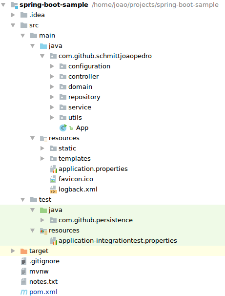

# Spring boot + Redis + Neo4j + security

This study objective evaluates superficially the spring boot framework integrated with two persistence mechanisms, implementing some common requirements present in a huge number of applications. The contribution aims to share a common architecture to be used as a base to create new projects. The technologies used in this project are:
* Spring boot 2.0.0.M7
* Redis
* Neo4J

The functional requirements are:
* Anonymous users can only access the login and register pages
* Authenticated users can access all pages

The non-functional requirements are:
* An authenticated user cannot lose the session when the server is restarted
* A business entity should be saved with only one click (cascade model)

# Environment

The development environment is composed of the following programs:
* JDK versão 9.0.1+11 64bit
* IntelliJ IDEA Community 2017.1.4
* Maven 3.3.9
* Docker 17.09.1-ce
* Redis 4.0.6 64bits
* Neo4j 3.3.1
* Ubuntu 16.04 LTS

To prepare the development environment is necessary to execute the following steps: 
 * Import on IntelliJ the project from [GitHub](https://github.com/schmittjoaopedro/spring-boot-sample)
 * Start Redis with the command `docker run redis`
 * Start Neo4j with the command `docker run --publish=7474:7474 --publish=7687:7687 --volume=$HOME/neo4j/data:/data neo4j`

# Project

In the next subsections will be presented the source code organization.

## pom.xml

```xml
<?xml version="1.0" encoding="UTF-8"?>
<project xmlns="http://maven.apache.org/POM/4.0.0" xmlns:xsi="http://www.w3.org/2001/XMLSchema-instance" xsi:schemaLocation="http://maven.apache.org/POM/4.0.0 http://maven.apache.org/xsd/maven-4.0.0.xsd">

    <!-- Project header -->
    <modelVersion>4.0.0</modelVersion>
    <groupId>com.github.schmittjoaopedro</groupId>
    <artifactId>spring-boot-sample</artifactId>
    <version>0.0.1-SNAPSHOT</version>
    <packaging>jar</packaging>
    <name>spring-boot-sample</name>
    <description>Demo project for Spring Boot</description>
    <url>https://github.com/schmittjoaopedro/spring-boot-sample</url>

    <!-- Spring boot configuration -->
    <parent>
        <groupId>org.springframework.boot</groupId>
        <artifactId>spring-boot-starter-parent</artifactId>
        <version>2.0.0.M7</version>
    </parent>

    <!-- Source code and compiler properties -->
    <properties>
        <project.build.sourceEncoding>UTF-8</project.build.sourceEncoding>
        <project.reporting.outputEncoding>UTF-8</project.reporting.outputEncoding>
        <java.version>1.8</java.version>
    </properties>

    <dependencies>
        <!-- TEST -->
        <dependency>
            <groupId>org.springframework.boot</groupId>
            <artifactId>spring-boot-starter-test</artifactId>
            <scope>test</scope>
        </dependency>
        <!-- DATA -->
        <dependency>
            <groupId>org.springframework.data</groupId>
            <artifactId>spring-data-neo4j</artifactId>
        </dependency>
        <dependency>
            <groupId>org.neo4j</groupId>
            <artifactId>neo4j-ogm-bolt-driver</artifactId>
            <version>${neo4j-ogm.version}</version>
        </dependency>
        <!-- WEB -->
        <dependency>
            <groupId>org.springframework.boot</groupId>
            <artifactId>spring-boot-starter-thymeleaf</artifactId>
        </dependency>
        <dependency>
            <groupId>org.springframework.boot</groupId>
            <artifactId>spring-boot-starter-web</artifactId>
        </dependency>
        <dependency>
            <groupId>org.springframework.boot</groupId>
            <artifactId>spring-boot-starter-data-redis</artifactId>
        </dependency>
        <dependency>
            <groupId>org.springframework.session</groupId>
            <artifactId>spring-session-data-redis</artifactId>
        </dependency>
        <!-- SECURITY -->
        <dependency>
            <groupId>org.springframework.security</groupId>
            <artifactId>spring-security-config</artifactId>
        </dependency>
        <dependency>
            <groupId>org.springframework.security</groupId>
            <artifactId>spring-security-web</artifactId>
        </dependency>
        <dependency>
            <groupId>org.springframework.security</groupId>
            <artifactId>spring-security-core</artifactId>
        </dependency>
        <dependency>
            <groupId>org.springframework.security</groupId>
            <artifactId>spring-security-ldap</artifactId>
        </dependency>
    </dependencies>

    <build>
        <plugins>
            <plugin>
                <groupId>org.springframework.boot</groupId>
                <artifactId>spring-boot-maven-plugin</artifactId>
            </plugin>
            <plugin>
                <groupId>org.apache.maven.plugins</groupId>
                <artifactId>maven-pmd-plugin</artifactId>
                <version>3.8</version>
            </plugin>
        </plugins>
    </build>

    <!-- Additional repositories to use spring-boot milestones version 2 -->
    <repositories>
        <repository>
            <id>spring-snapshots</id>
            <url>http://repo.spring.io/snapshot</url>
            <snapshots><enabled>true</enabled></snapshots>
        </repository>
        <repository>
            <id>spring-milestones</id>
            <url>http://repo.spring.io/milestone</url>
        </repository>
    </repositories>
    <pluginRepositories>
        <pluginRepository>
            <id>spring-snapshots</id>
            <url>http://repo.spring.io/snapshot</url>
        </pluginRepository>
        <pluginRepository>
            <id>spring-milestones</id>
            <url>http://repo.spring.io/milestone</url>
        </pluginRepository>
    </pluginRepositories>

</project>
```

## Packages structure

The files and packages are structured as follows:



A brief description of the main packages:
* src/main/java - contains all java source code of the application
* src/main/resources/static - contains all static files (js, css e images)
* src/main/resources/templates - contains all web pages mapped by the server with controllers
* src/test - contains all files to test the application

## Source code

The *App.java* file is the main Java class used to start the WEB app.

App.java 
```java
package com.github.schmittjoaopedro;

import org.springframework.boot.SpringApplication;
import org.springframework.boot.autoconfigure.SpringBootApplication;
import org.springframework.boot.autoconfigure.session.SessionAutoConfiguration;

// A convenience annotation used to configure the application 
@SpringBootApplication
public class App {

    public static void main(String[] args) {
        SpringApplication.run(App.class, args);
    }

}
```

### The *configuration* package

The next class describes the connector configuration used to persist data in Neo4j using Spring Data Neo4j (SDN).

PersistenceContextConfig.java
```java
package com.github.schmittjoaopedro.configuration;

import org.neo4j.ogm.session.SessionFactory;
import org.springframework.context.annotation.Bean;
import org.springframework.context.annotation.ComponentScan;
import org.springframework.context.annotation.Configuration;
import org.springframework.context.annotation.PropertySource;
import org.springframework.core.env.Environment;
import org.springframework.data.neo4j.repository.config.EnableNeo4jRepositories;
import org.springframework.data.neo4j.transaction.Neo4jTransactionManager;
import org.springframework.transaction.annotation.EnableTransactionManagement;

import javax.annotation.Resource;

@Configuration
@ComponentScan("com.github.schmittjoaopedro")
@EnableTransactionManagement
@EnableNeo4jRepositories("com.github.schmittjoaopedro.repository")
@PropertySource("classpath:application.properties")
public class PersistenceContextConfig {
    
    @Resource
    private Environment env; // Receive the properties from "application.properties" file
    
    @Bean
    public SessionFactory getSessionFactory() {
        SessionFactory sessionFactory = new SessionFactory(configuration(), "com.github.schmittjoaopedro.domain");
        return sessionFactory;
    }
    
    @Bean
    public Neo4jTransactionManager transactionManager() throws Exception {
        return new Neo4jTransactionManager(getSessionFactory());
    }
    
    @Bean
    public org.neo4j.ogm.config.Configuration configuration() {
        String username = env.getProperty("spring.data.neo4j.username");
        String password = env.getProperty("spring.data.neo4j.password");
        String uri = env.getProperty("spring.data.neo4j.uri");
        return new org.neo4j.ogm.config.Configuration.Builder()
            .uri(uri)
            .credentials(username, password)
            .build();
    }

}
```

In authentication terms are presented in the next class three ways to obtain the login data, using Active Directory (AD), using an object in memory and using a database.

In authorization terms, is allowed to anonymous users (users not authenticated) to access the necessary resources to create a new account and to make login in the application.

WebSecurityConfig.java
```java
package com.github.schmittjoaopedro.configuration;

import org.springframework.beans.factory.annotation.Autowired;
import org.springframework.context.annotation.Bean;
import org.springframework.context.annotation.Configuration;
import org.springframework.security.authentication.AuthenticationProvider;
import org.springframework.security.config.annotation.authentication.builders.AuthenticationManagerBuilder;
import org.springframework.security.config.annotation.web.builders.HttpSecurity;
import org.springframework.security.config.annotation.web.configuration.EnableWebSecurity;
import org.springframework.security.config.annotation.web.configuration.WebSecurityConfigurerAdapter;
import org.springframework.security.core.userdetails.UserDetailsService;
import org.springframework.security.crypto.bcrypt.BCryptPasswordEncoder;
import org.springframework.security.ldap.authentication.ad.ActiveDirectoryLdapAuthenticationProvider;
import org.springframework.security.web.authentication.AuthenticationSuccessHandler;
import org.springframework.security.web.authentication.SimpleUrlAuthenticationSuccessHandler;

import javax.annotation.Resource;

@Configuration
@EnableWebSecurity
public class WebSecurityConfig extends WebSecurityConfigurerAdapter {

    private static final String DOMAIN = "com.example";

    private static final String URL = "ldap://ad_app.example.com:389";

    private static final String ROOT_DN = "DC=example,DC=com";

    @Resource
    private UserDetailsService userDetailsService;

    @Bean
    public BCryptPasswordEncoder bCryptPasswordEncoder() {
        return new BCryptPasswordEncoder();
    }

    @Autowired
    public void configureGlobal(AuthenticationManagerBuilder auth) throws Exception {
        // Active Directory (AD) authentication
        //auth.authenticationProvider(activeDirectoryLdapAuthenticationProvider());

        //Memory authentication
        //auth.inMemoryAuthentication()
        //        .passwordEncoder(NoOpPasswordEncoder.getInstance())
        //        .withUser("user")
        //        .password("pass")
        //        .roles("USER");

        //Database authentication
        auth.userDetailsService(userDetailsService).passwordEncoder(bCryptPasswordEncoder());
    }

    @Override
    protected void configure(HttpSecurity http) throws Exception {
        http
            .csrf()
            .disable()
        .authorizeRequests()
            .antMatchers("/assets/**", "/api/**", "/login", "/login.jsp", "/register", "/register.jsp", "/css/**", "/js/**", "/images/**", "/**/favicon.ico").permitAll()
            .anyRequest().authenticated()
            .and()
        .formLogin()
            .loginPage("/login")
            .successHandler(successHandler())
            .permitAll()
            .and()
        .logout()   
            .permitAll()
            .and()
        .httpBasic();
    }

    @Bean // A provider used to connect to an AD server
    public AuthenticationProvider activeDirectoryLdapAuthenticationProvider() {
        ActiveDirectoryLdapAuthenticationProvider authenticationProvider = new ActiveDirectoryLdapAuthenticationProvider(DOMAIN, URL, ROOT_DN);
        authenticationProvider.setConvertSubErrorCodesToExceptions(true);
        authenticationProvider.setUseAuthenticationRequestCredentials(true);
        return authenticationProvider;
    }

    @Bean // Default redirect after user authentication
    public AuthenticationSuccessHandler successHandler() {
        SimpleUrlAuthenticationSuccessHandler handler = new SimpleUrlAuthenticationSuccessHandler();
        handler.setDefaultTargetUrl("/");
        return handler;
    }

}
```

### The *controller* package

The *controller* package contains all classes to create the REST layer of the application.
The class *ApiController.java* implements public application procedures allowed to anonymous users.
The class *PagesController.java* implements mapping to HTML files. Example, we can access the web page "application/user-admin.html" calling "/users".
The classes *RoleController.java* and *UserController.java* implements server procedures for authenticated users.

ApiController.java
```java
package com.github.schmittjoaopedro.controller;

import com.github.schmittjoaopedro.domain.User;
import com.github.schmittjoaopedro.service.UserService;
import org.springframework.web.bind.annotation.PostMapping;
import org.springframework.web.bind.annotation.RequestBody;
import org.springframework.web.bind.annotation.RequestMapping;
import org.springframework.web.bind.annotation.RestController;

import javax.annotation.Resource;

@RestController
@RequestMapping("/api/") // The /api is allowed to be used by anonymous users
public class ApiController {

    @Resource
    private UserService userService;

    @PostMapping("/register")
    public void createAccount(@RequestBody User user) {
        if(user.getId() == null)
            userService.createAccount(user);
    }

}

```
PagesController.java
```java
package com.github.schmittjoaopedro.controller;

import com.github.schmittjoaopedro.utils.SessionManager;
import org.springframework.stereotype.Controller;
import org.springframework.ui.Model;
import org.springframework.web.bind.annotation.GetMapping;

@Controller
public class PagesController {

    @GetMapping("/")
    public String getHomePage(Model model) {
        model.addAttribute("user", SessionManager.getInstances().getSessionUser());
        model.addAttribute("module", "home");
        return "index";
    }

    @GetMapping("/users")
    public String getUsersPage(Model model) {
        model.addAttribute("user", SessionManager.getInstances().getSessionUser());
        model.addAttribute("module", "users");
        return "application/user-admin";
    }

    @GetMapping("/roles")
    public String getRolesPage(Model model) {
        model.addAttribute("user", SessionManager.getInstances().getSessionUser());
        model.addAttribute("module", "roles");
        return "application/role-admin";
    }

    @GetMapping("/login")
    public String getLoginPage() {
        return "login";
    }

    @GetMapping("/register")
    public String getRegisterPage() {
        return "register";
    }

}
```
UserController.java
```java
package com.github.schmittjoaopedro.controller;

import com.github.schmittjoaopedro.domain.User;
import com.github.schmittjoaopedro.service.UserService;
import org.springframework.web.bind.annotation.*;

import javax.annotation.Resource;
import java.util.List;

@RestController
@RequestMapping("/resources/users")
public class UserController {

    @Resource
    private UserService userService;

    @PostMapping
    public void create(@RequestBody User user) {
        userService.save(user);
    }

    @PutMapping
    public void update(@RequestBody User user) {
        userService.save(user);
    }

    @GetMapping
    public List<User> findAll() {
        return userService.findAll();
    }

    @GetMapping("/{id}")
    public User findById(@PathVariable("id") Long id) {
        return userService.findById(id);
    }

}
```

### The *domain* package

The package *domain* contains all java entities used by the application representing the business objects. For example, the classes *User.java* and *Role.java* are used to implements the authentication and authorization. All domain objects are configured to be persisted at Neo4j using SDN. Following are presented the classes *User.java* and *Role.java*.

Role.java
```java
package com.github.schmittjoaopedro.domain;

import com.fasterxml.jackson.annotation.JsonIgnore;
import org.neo4j.ogm.annotation.GeneratedValue;
import org.neo4j.ogm.annotation.Id;
import org.neo4j.ogm.annotation.NodeEntity;

import java.io.Serializable;
import java.util.HashSet;
import java.util.Set;

@NodeEntity
public class Role implements Serializable {

    private static final long serialVersionUID = 1L;

    @Id
    @GeneratedValue
    private Long id;

    private String name;

    @JsonIgnore // Block creation of cyclical references with Jackson
    private Set<User> users = new HashSet<>();

    public Role() {
        super();
    }

    public Long getId() {
        return id;
    }

    public void setId(Long id) {
        this.id = id;
    }

    public String getName() {
        return name;
    }

    public void setName(String name) {
        this.name = name;
    }

    public Set<User> getUsers() {
        return users;
    }

    public void setUsers(Set<User> users) {
        this.users = users;
    }

}
```

### The *repository* package

The *repository* package provides methods to persist domain objects in Neo4j database. Using SDN the interface definition extending the class Neo4jRepository gives a default implementation that executes standard database operations, and when a more specific implementation is necessary, the standard interface can be implemented.

RoleRepository:
```java
package com.github.schmittjoaopedro.repository;

import com.github.schmittjoaopedro.domain.Role;
import org.springframework.data.neo4j.repository.Neo4jRepository;

public interface RoleRepository extends Neo4jRepository<Role, Long> {

    Role findByName(String name);

}
```

### The *service* package

This package is used to prepare persistence objects to be pre-processed and to execute business logic. In this architecture, the *service* layer open the transaction with the database. The following class shows an example.

RoleService.java
```java
package com.github.schmittjoaopedro.service;

import com.github.schmittjoaopedro.domain.Role;
import com.github.schmittjoaopedro.repository.RoleRepository;
import org.springframework.stereotype.Service;

import javax.annotation.Resource;
import java.util.ArrayList;
import java.util.List;

@Service
public class RoleService {

    @Resource
    private RoleRepository roleRepository;

    public void saveRole(Role role) {
        roleRepository.save(role);
    }

    public List<Role> findAll() {
        List<Role> roles = new ArrayList<>();
        for(Role role : roleRepository.findAll()) {
            roles.add(role);
        }
        return roles;
    }

    public Role findRoleByName(String name) {
        return roleRepository.findByName(name);
    }

    public Role findRoleById(Long id) {
        return roleRepository.findById(id).get();
    }

}
```

### The *utils* package

The package *utils* has some utilities to be used at runtime. Examples of utility classes are presented at following.

The class *ContextProvider* give access to beans managed by Spring without declaring annotated attributes with @Resource or @Autowired.

ContextProvider.java
```java
package com.github.schmittjoaopedro.utils;

import org.springframework.beans.BeansException;
import org.springframework.context.ApplicationContext;
import org.springframework.context.ApplicationContextAware;
import org.springframework.stereotype.Component;

@Component
public class ContextProvider implements ApplicationContextAware {

    private static ApplicationContext CONTEXT;

    @Override
    public void setApplicationContext(ApplicationContext applicationContext) throws BeansException {
        CONTEXT = applicationContext;
    }

    public static <T> T getBean(Class<T> beanClass) {
        return CONTEXT.getBean(beanClass);
    }

    public static Object getBean(String beanName) {
        return CONTEXT.getBean(beanName);
    }

}
```

The *SessionManager* class implements a utility method that returns the session user object stored in Redis.

SessionManager.java
```java
package com.github.schmittjoaopedro.utils;

import org.springframework.security.core.Authentication;
import org.springframework.security.core.context.SecurityContext;
import org.springframework.security.core.context.SecurityContextHolder;
import org.springframework.security.core.userdetails.UserDetails;

public class SessionManager {

    private static final SessionManager SESSION_MANAGER = new SessionManager();

    private SessionManager() {
        super();
    }

    public static SessionManager getInstances() {
        return SESSION_MANAGER;
    }

    public UserDetails getSessionUser() {
        SecurityContext securityContext = SecurityContextHolder.getContext();
        Authentication authentication = securityContext.getAuthentication();
        if (authentication != null) {
            Object principal = authentication.getPrincipal();
            return principal instanceof UserDetails ? (UserDetails) principal : null;
        }
        return null;
    }

}
```

## Tests

The annotated *FullPersistenceTest* class shows an example used to create integrated tests. This class aims to validate the functionalities of SDN as creation, modification, and deletion using complex structures.

The first test detected that SDN does not make possible to eliminate one-to-one relationships when defining an entity attribute as null of the object instance being persisted.

The second test detected that, when an entity is removed from a collection (one-to-many or many-to-many relationship), is not possible to save the entity owner of the collection removing the detached objects (cascade removal).

Is concluded that using SDN to persist stateless objects with more complex structures, is very hard to manage relationships as is made with JPA and Hibernate for cascade persisting.
The next code shows the *FullPersistenceTest*. 

FullPersistenceTest.java
```java
package com.github.persistence;

import com.github.schmittjoaopedro.App;
import com.github.schmittjoaopedro.domain.*;
import com.github.schmittjoaopedro.repository.ObjectValueRepository;
import com.github.schmittjoaopedro.service.AttributeService;
import com.github.schmittjoaopedro.service.ClassTypeService;
import com.github.schmittjoaopedro.service.ObjectInstanceService;
import org.junit.*;
import org.junit.runner.RunWith;
import org.junit.runners.MethodSorters;
import org.springframework.boot.test.autoconfigure.web.servlet.AutoConfigureMockMvc;
import org.springframework.boot.test.context.SpringBootTest;
import org.springframework.test.context.TestPropertySource;
import org.springframework.test.context.junit4.SpringRunner;

import javax.annotation.Resource;

@RunWith(SpringRunner.class)
@SpringBootTest(
        webEnvironment = SpringBootTest.WebEnvironment.RANDOM_PORT,
        classes = App.class)
@AutoConfigureMockMvc
@TestPropertySource(
        locations = "classpath:application-integrationtest.properties")
@FixMethodOrder(MethodSorters.NAME_ASCENDING)
public class FullPersistenceTest {

    @Resource
    private AttributeService attributeService;

    @Resource
    private ObjectInstanceService objectInstanceService;

    @Resource
    private ClassTypeService classTypeService;

    @Resource
    private ObjectValueRepository objectValueRepository;

    @Test
    public void _clearDatabase() {
        objectInstanceService.deleteAll();
        classTypeService.deleteAll();
        attributeService.deleteAll();
    }

    @Test
    public void createFullApplication() {

        Attribute C1 = new Attribute();
        C1.setName("CHARACTERISTIC_1");
        C1.setType(AttributeType.String);
        C1 = attributeService.save(C1);

        AttributeDescription C1DPT = new AttributeDescription();
        C1DPT.setLanguage("pt");
        C1DPT.setDescription("Característica Um");
        C1.getDescriptions().add(C1DPT);
        AttributeDescription C1EN = new AttributeDescription();
        C1EN.setLanguage("en");
        C1EN.setDescription("Attribute One");
        C1.getDescriptions().add(C1EN);
        C1 = attributeService.save(C1);

        C1.getDescriptions().stream().filter(item -> item.getLanguage().equals("pt")).findFirst().get().setDescription("Característica 1");
        C1.getDescriptions().stream().filter(item -> item.getLanguage().equals("en")).findFirst().get().setDescription("Attribute 1");
        C1 = attributeService.save(C1);

        AttributeValue C1V1 = new AttributeValue();
        C1V1.setAttribute(C1);
        C1V1.setValue("00001");
        C1.getValues().add(C1V1);
        AttributeValue C1V2 = new AttributeValue();
        C1V2.setAttribute(C1);
        C1V2.setValue("00002");
        AttributeValueDescription C1V2DPT = new AttributeValueDescription();
        C1V2DPT.setLanguage("pt");
        C1V2DPT.setDescription("Valor 00002");
        C1V2.getDescriptions().add(C1V2DPT);
        AttributeValueDescription C1V2DEN = new AttributeValueDescription();
        C1V2DEN.setLanguage("en");
        C1V2DEN.setDescription("Value 00002");
        C1V2.getDescriptions().add(C1V2DEN);
        C1.getValues().add(C1V2);
        C1 = attributeService.save(C1);

        C1.getValues().stream().filter(item -> item.getValue().equals("00002")).findFirst().get().getDescriptions().stream().filter(item -> item.getLanguage().equals("pt")).findFirst().get().setDescription("Valor 2");
        C1.getValues().stream().filter(item -> item.getValue().equals("00002")).findFirst().get().getDescriptions().stream().filter(item -> item.getLanguage().equals("en")).findFirst().get().setDescription("Value 2");
        C1 = attributeService.save(C1);

        ClassType OT1 = new ClassType();
        OT1.setName("OBJECT_TYPE_1");
        OT1.getAttributes().add(C1);
        OT1 = classTypeService.save(OT1);

        ObjectInstance O1 = new ObjectInstance();
        O1.setClassType(OT1);
        ObjectValue O1V1 = new ObjectValue();
        O1V1.setValue("00001");
        O1V1.setAttribute(C1);
        O1V1.setObjectInstance(O1);
        O1.getValues().add(O1V1);
        ObjectInstance O2 = new ObjectInstance();
        O2.setClassType(OT1);
        ObjectValue O2V1 = new ObjectValue();
        O2V1.setValue("00001");
        O2V1.setAttribute(C1);
        O2V1.setObjectInstance(O2);
        O2.getValues().add(O2V1);
        O1.getChildren().add(O2);
        ObjectInstance O3 = new ObjectInstance();
        O3.setClassType(OT1);
        ObjectValue O3V1 = new ObjectValue();
        O3V1.setValue("00001");
        O3V1.setAttribute(C1);
        O3V1.setObjectInstance(O3);
        O3.getValues().add(O3V1);
        O2.getChildren().add(O3);
        O1 = objectInstanceService.save(O1);

        // Tries to remove the direct association, but defining the attribute as null doesn't delete the relationship. 
        // Is necessary execute a manual query.
        ObjectValue OV = objectValueRepository.findById(O1.getValues().get(0).getId()).get();
        OV.setValue("00002");
        OV.setAttribute(null);
        objectValueRepository.save(OV);
        objectValueRepository.removeCharacteristic(OV.getId());

        // Tries to remove a value from the list, but on saving the root entity the value removed from the list is not deleted. 
        // Is necessary delete explicitly the value. (cascade mode doesn't works)
        O1 = objectInstanceService.findOne(O1.getId());
        OV = O1.getValues().get(0);
        OV.setObjectInstance(null);
        O1.getValues().clear();
        objectInstanceService.save(O1);
        objectValueRepository.delete(OV);

        Assert.assertTrue(true);
    }

}

```

# Conclusion

The conclusion in using spring boot to develop an application is that the framework is simplified letting easier the web application development.

The security and persistence configuration using annotations makes the application cleaner and with fewer mixtures of .java and .xml files.

The difficulties found are related to using SDN to persist objects as is made in JPA. For this project a relational database should be more suitable.